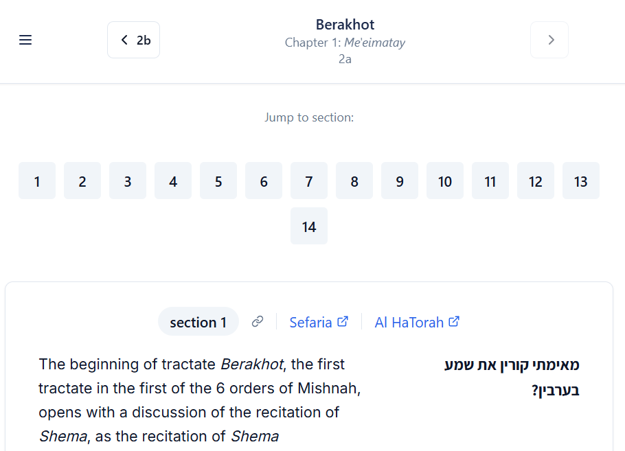

# Bekiut - Classical Jewish Texts Study Platform

**[https://bekiut.com](https://bekiut.com)**

*Formerly known as ChavrutAI — renamed to Bekiut in July 2026.*

A web application for studying classical Jewish texts, featuring bilingual Hebrew-English access to the Babylonian Talmud, Jerusalem Talmud, Mishnah, Mishneh Torah, and Tanakh, alongside integrated reference tools, dictionaries, and an AI study assistant.

## Overview

Bekiut is a full-featured digital platform providing bilingual (Hebrew/English) access to the major corpora of classical Jewish literature. Originally launched as a Babylonian Talmud reader, the platform has grown into a multi-text library covering five primary works, with an expanding suite of study tools, reference dictionaries, and cross-text navigation features. Built with modern web technologies, it combines traditional scholarship with contemporary user experience design.

## Recognition

Bekiut is featured in the official [Sefaria Powered-By directory](https://developers.sefaria.org/docs/powered-by-sefaria), a curated list of projects and applications built using the Sefaria API and text data.

Bekiut is listed in the [JewishAI Internet Index](https://jewishai.me/table.html), the AI and Judaism Resource Library's curated index of tools, scholarship, and discussions at the intersection of Jewish tradition and modern artificial intelligence.

## Demo Video and Screenshot

https://github.com/user-attachments/assets/b046339f-26ff-4bb5-ab92-7002c33bc7e3



*The Talmud reading page displaying Berakhot 2a — the opening folio of the entire Talmud. Hebrew and English text appear side by side, with numbered section navigation, direct links to Sefaria and Al HaTorah, and folio navigation controls.*

## Featured Articles

From my [Talmud & Tech](https://www.ezrabrand.com/) blog, where I write about building and developing Bekiut:

- [ChavrutAI Talmud Web App Launch: Review and Comparison with Similar Platforms](https://www.ezrabrand.com/p/chavrutai-talmud-web-app-launch-review) *(Aug 2025)*
- [ChavrutAI's New Homepage: A Fresh Entry Point for the Study of Classical Jewish Texts](https://www.ezrabrand.com/p/chavrutais-new-homepage-a-fresh-entry) *(Dec 2025)*
- [ChavrutAI's Talmud Translation Processing Approach](https://www.ezrabrand.com/p/chavrutais-talmud-translation-processing) *(Dec 2025)*

*(Article titles retain the platform's original name, ChavrutAI.)*

## Primary Texts

### Babylonian Talmud (Talmud Bavli)
- All **37 tractates** with over 5,400 folio pages
- Bilingual Hebrew/English display with side-by-side or stacked layout
- Traditional folio numbering (2a, 2b, 3a…)
- Section-by-section navigation with inline chapter headers
- Mishnah and Talmud markers styled as distinct section headers, with Mishnah citations linked to the Mishnah reader
- External links to Sefaria, Al HaTorah, Wikisource, and Daf Yomi at page and section level

### Jerusalem Talmud (Talmud Yerushalmi)
- **39 tractates** organized by Seder with bilingual text
- Per-halakhah pages (e.g. `/yerushalmi/Chagigah/2.1`) matching scholarly citation conventions
- Halakhah-by-halakhah navigation crossing chapter boundaries

### Mishnah
- All **63 tractates** organized by the six Sedarim
- Bilingual Hebrew/English chapter readers (50/50 columns)
- 26 standalone tractates not covered by the Talmud Bavli reader

### Mishneh Torah (Rambam)
- All **83 Books** of Maimonides' code of Jewish law
- Bilingual text with Maimonides' Introduction (Hakdamah/Transmission of the Oral Law) integrated

### Tanakh (Hebrew Bible)
- Torah, Prophets (Nevi'im), and Writings (Ketuvim)
- Hebrew text with Koren Jerusalem Bible English translation
- Verse-level external links to Sefaria, Al HaTorah, and Wikisource

## Study Tools

### Dictionaries & Lexicons
- **Jastrow Dictionary** (`/jastrow`) — Talmudic Hebrew & Aramaic; search, browse by letter, autosuggest, internal cross-references, Mishnah and Talmud links to Bekiut pages
- **Brown-Driver-Briggs (BDB)** (`/bdb`) — Biblical Hebrew lexicon with verbal stem labels, numbered section labels, Bible citations linked to the Bekiut Bible reader, and scholar abbreviation expansion

### Reference & Index
- **Biblical Index** (`/biblical-index`) — comprehensive index of biblical citations in the Talmud, organized by book (Torah, Prophets, Writings)
- **Mishnah Map** (`/mishnah-map`) — maps every Mishnah passage to its location in the Talmud Bavli, with inline notes where chapter ordering diverges
- **Talmud Term Index** (`/term-index`) — tabbed, searchable glossary of 5,385+ personal names, place names, and key concepts from the Babylonian Talmud, with biographical data from Wikidata and links to corpus passages

### Study Aids
- **Sugya Viewer** (`/sugya-viewer`) — fetch and study custom Talmud text ranges; accepts Bekiut references, Sefaria references/URLs, or blog post selection; shareable URLs
- **Full-Text Search** (`/search`) — search across Talmud and Bible texts in Hebrew and English, with section-level result links
- **Suggested Pages** (`/suggested-pages`) — curated list of 20+ famous Talmudic passages (Hillel's Golden Rule, Hannah's Prayer, "Who is wise?", etc.)
- **Daf Yomi Widget** — today's Talmud page with a direct study link, shown on the homepage
- **AI Study Assistant** — chat panel for studying any Talmud passage

### Scholarship
- **J.N. Epstein's Introductions** (`/scholarship`) — Introductions to Tanaitic Literature and to Amoraic Literature; paginated reader with footnotes as margin notes (desktop) or collapsible panel (mobile), floating footnote popovers, and links to Sefaria
- **Blog Posts** (`/blog-posts`) — "Talmud & Tech" articles mapped to specific Talmudic locations

## Advanced Text Processing

- **Intelligent term highlighting** with 5,385+ terms across multiple gazetteers: concepts, personal names, place names, biblical references, and Talmudic toponyms
- **Smart paragraph splitting** for improved readability across all five corpora
- **Punctuation normalization** per-corpus: dialogue markers, rhetorical openers, and speech introducers styled consistently in Hebrew and English
- **Number and fraction conversion** from written-out English forms to numerals
- **RTL/LTR support** for Hebrew text alongside English
- **Abbreviation expansion** for BDB grammatical and source-critical terms, scholar names, and Ethiopic/Greek/Arabic/Syriac transliteration annotation

## Customizable Reading Experience

- **Text size** — 5 levels (extra-small to extra-large)
- **Hebrew font** — 7 options (Calibri, Times, Frank Ruehl, Noto Sans Hebrew, Noto Serif Hebrew, Assistant, David Libre)
- **English font** — 4 options (Roboto, Inter, Source Sans 3, Open Sans)
- **Theme** — Paper (sepia/parchment), White, Dark, High Contrast
- **Layout** — side-by-side or stacked bilingual display
- **Highlighting toggles** — enable/disable by category (Concepts, Names, Places)
- **Persistent settings** saved to browser localStorage

## Pages & Routes

### Primary Text Readers
| Page | Route | Description |
|------|-------|-------------|
| **Talmud Contents** | `/talmud` | All 37 tractates organized by Seder |
| **Talmud Tractate** | `/talmud/:tractate` | Chapter grid and folio ranges |
| **Talmud Folio** | `/talmud/:tractate/:folio` | Bilingual reading page with full navigation |
| **Chapter Outline** | `/outline/:tractate/:chapter` | Topic-based outline for a chapter |
| **Tanakh Contents** | `/bible` | All books by division |
| **Bible Book** | `/bible/:book` | Chapter list for a book |
| **Bible Chapter** | `/bible/:book/:chapter` | Bilingual verse-by-verse reading |
| **Mishnah Contents** | `/mishnah` | All 63 tractates by Seder |
| **Mishnah Tractate** | `/mishnah/:tractate` | Chapter TOC with mishnah counts |
| **Mishnah Chapter** | `/mishnah/:tractate/:chapter` | Bilingual chapter reader |
| **Yerushalmi Contents** | `/yerushalmi` | All 39 tractates by Seder |
| **Yerushalmi Tractate** | `/yerushalmi/:tractate` | Chapter list with halakhah counts |
| **Yerushalmi Halakhah** | `/yerushalmi/:tractate/:chapter.:halakhah` | Per-halakhah bilingual reader |
| **Mishneh Torah Contents** | `/rambam` | All 83 Books organized by topic |
| **Rambam Book** | `/rambam/:book` | Chapter list |
| **Rambam Chapter** | `/rambam/:book/:chapter` | Bilingual chapter reader |

### Study Tools
| Page | Route | Description |
|------|-------|-------------|
| **Jastrow Dictionary** | `/jastrow` | Talmudic Hebrew & Aramaic dictionary |
| **BDB Dictionary** | `/bdb` | Brown-Driver-Briggs Biblical Hebrew lexicon |
| **Biblical Index** | `/biblical-index` | Biblical citations in the Talmud by book |
| **Mishnah Map** | `/mishnah-map` | Mishnah-to-Talmud passage mapping |
| **Talmud Term Index** | `/term-index` | Names, places, and concepts glossary |
| **Sugya Viewer** | `/sugya-viewer` | Custom Talmud text range study |
| **Search** | `/search` | Full-text search across all texts |
| **Suggested Pages** | `/suggested-pages` | Curated famous passages |
| **J.N. Epstein's Introductions** | `/scholarship` | Academic introductions to Talmudic literature |
| **Blog Posts** | `/blog-posts` | "Talmud & Tech" articles mapped to Talmud |

### Information Pages
| Page | Route | Description |
|------|-------|-------------|
| **About** | `/about` | Project information and philosophy |
| **Contact** | `/contact` | Contact form and feedback channel |
| **Sitemap** | `/sitemap` | Human-readable hierarchical sitemap |
| **Privacy** | `/privacy` | Privacy policy |
| **Changelog** | `/changelog` | Version history and feature updates |

## Technology Stack

- **Frontend:** React 18, TypeScript, Vite, Tailwind CSS + shadcn/ui, TanStack Query, Wouter
- **Backend:** Express.js, TypeScript, Drizzle ORM + PostgreSQL (Neon serverless)
- **AI:** Vercel AI SDK + Claude via OpenRouter (`@openrouter/ai-sdk-provider`)
- **Analytics:** PostHog
- **External APIs:** Sefaria (texts and dictionaries), talmud-nlp-indexer (term highlighting gazetteers)

## Project Structure

The project is a pnpm monorepo with two main artifacts: the web frontend (`artifacts/chavrutai`) and the API server (`artifacts/api-server`).

```
artifacts/chavrutai/src/
  pages/            — route pages (tractate-view, bible-chapter, mishnah-*, yerushalmi-*, rambam-*, etc.)
  components/       — UI components (text/, navigation/, bible/, outline/)
  lib/              — utilities (text-processing, gazetteer, analytics)
  hooks/            — custom hooks (use-seo, use-chat, use-mobile)
  context/          — React context providers (preferences)
  server/           — production SSR/SEO server (crawler meta injection, domain redirects)
  shared/           — brand config, SEO data, text processing, corpus data (see below)
artifacts/chavrutai/public/
  data/chapters/    — JSON files for 37 Bavli tractates (chapter/outline data)
artifacts/api-server/src/
  routes/           — domain-focused route modules:
    seo.ts          — crawler detection, meta tags, structured data, crawler body injection
    talmud.ts       — Talmud text, tractates, chapters
    mishnah.ts      — Mishnah tractates, info, chapter text
    yerushalmi.ts   — Yerushalmi tractates, info, halakhah text, shapes
    rambam.ts       — Rambam info, chapter text
    bible.ts        — Bible books, chapters, text
    dictionary.ts   — Jastrow and BDB search, browse, autosuggest
    chat.ts         — AI chat streaming via OpenRouter
    search.ts       — full-text search
    feed.ts         — RSS feeds, Daf Yomi
    sitemap-*.ts    — XML sitemap generators (one per corpus)
  storage.ts        — storage interface + in-memory implementation
artifacts/chavrutai/src/shared/  (mirrored in artifacts/api-server/src/shared/)
  brand.ts          — brand name and canonical domain (single source of truth)
  seo-data.ts       — single source of truth for all SEO titles, descriptions, and OG data
  text-processing.ts — shared text splitting/formatting (Hebrew + English)
  tractates.ts      — Talmud & Mishnah tractate data, URL normalization
  talmud-navigation.ts — page validation, prev/next navigation
  talmud-data.ts    — tractate metadata, folio ranges, Seder groupings
  yerushalmi-data.ts — Yerushalmi tractate/chapter/halakhah shapes and navigation
  mishnah-map.ts    — Mishnah-to-Talmud mapping data
  data/
    glossary_v4.json       — 5,385+ term glossary (names, places, concepts)
    yerushalmi-shapes.json — halakhah counts per chapter for all Yerushalmi tractates
```

## API Endpoints

### Talmud Bavli
- `GET /api/text` — folio text (Hebrew + English sections)
- `GET /api/tractates` — list all 37 tractates
- `GET /api/chapters` — chapter info for a tractate

### Tanakh
- `GET /api/bible/books` — list all books
- `GET /api/bible/chapters` — chapter list for a book
- `GET /api/bible/text` — chapter text

### Mishnah
- `GET /api/mishnah/tractates` — list all tractates
- `GET /api/mishnah/info/:tractate` — tractate metadata
- `GET /api/mishnah/:tractate/:chapter` — chapter text

### Yerushalmi
- `GET /api/yerushalmi/tractates` — list all tractates
- `GET /api/yerushalmi/info/:tractate` — tractate metadata
- `GET /api/yerushalmi/:tractate/:chapter/:halakhah` — halakhah text

### Mishneh Torah
- `GET /api/rambam/info/:book` — book metadata
- `GET /api/rambam/:book/:chapter` — chapter text

### Dictionaries
- `GET /api/dictionary/search` — Jastrow search
- `GET /api/dictionary/browse` — Jastrow browse by Hebrew letter
- `GET /api/dictionary/autosuggest` — Jastrow autocomplete
- `GET /api/bdb/search` — BDB search
- `GET /api/bdb/browse` — BDB browse by letter

### Other
- `GET /api/search/text` — full-text search across all corpora
- `GET /api/glossary` — term index data (JSON)
- `GET /api/daf-yomi` — today's Daf Yomi
- `GET /api/rss-feed` — blog feed (titles only)
- `GET /api/rss-feed-full` — blog feed (full content)
